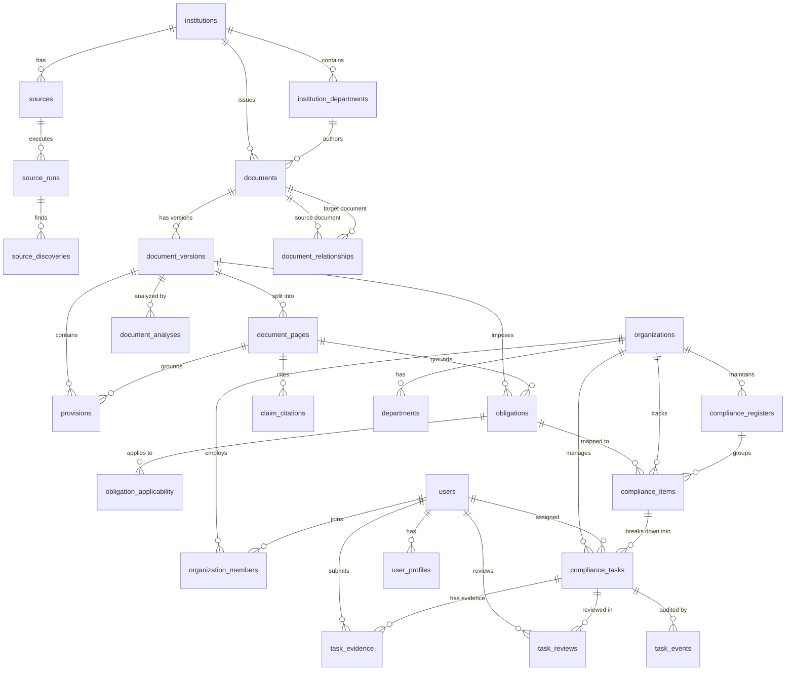

# Database Entity-Relationship Diagram (ERD)
## RegWatch Bangladesh Platform

```mermaid
erDiagram
    institutions ||--o{ institution_departments : "contains"
    institutions ||--o{ sources : "has"
    institutions ||--o{ documents : "issues"
    institution_departments ||--o{ documents : "authors"

    sources ||--o{ source_runs : "executes"
    source_runs ||--o{ source_discoveries : "finds"

    documents ||--o{ document_versions : "has versions"
    document_versions ||--o{ document_pages : "split into"
    document_versions ||--o{ provisions : "contains"
    document_versions ||--o{ obligations : "imposes"
    document_versions ||--o{ document_analyses : "analyzed by"

    document_pages ||--o{ provisions : "grounds"
    document_pages ||--o{ obligations : "grounds"
    document_pages ||--o{ claim_citations : "cites"

    documents ||--o{ document_relationships : "source document"
    documents ||--o{ document_relationships : "target document"

    obligations ||--o{ obligation_applicability : "applies to"
    obligations ||--o{ compliance_items : "mapped to"

    organizations ||--o{ departments : "has"
    organizations ||--o{ organization_members : "employs"
    organizations ||--o{ compliance_registers : "maintains"
    organizations ||--o{ compliance_items : "tracks"
    organizations ||--o{ compliance_tasks : "manages"

    users ||--o{ user_profiles : "has"
    users ||--o{ organization_members : "joins"
    users ||--o{ compliance_tasks : "assigned"
    users ||--o{ task_evidence : "submits"
    users ||--o{ task_reviews : "reviews"

    compliance_registers ||--o{ compliance_items : "groups"
    compliance_items ||--o{ compliance_tasks : "breaks down into"
    compliance_tasks ||--o{ task_evidence : "has evidence"
    compliance_tasks ||--o{ task_reviews : "reviewed in"
    compliance_tasks ||--o{ task_events : "audited by"
```
